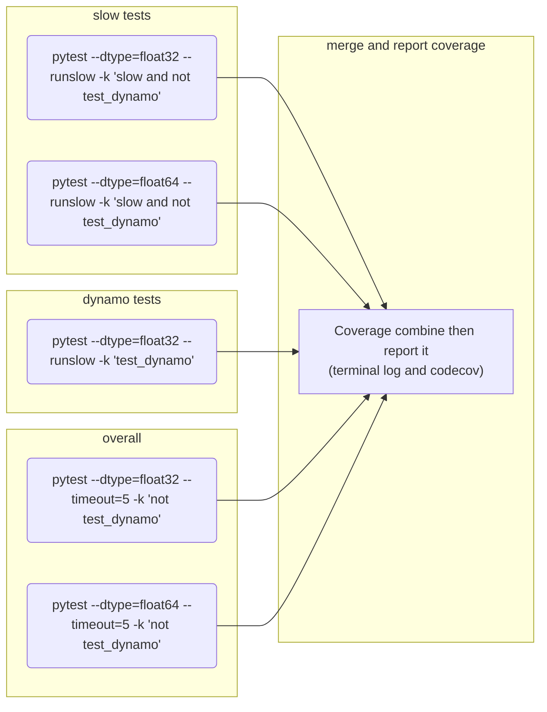

# Kornia Workflows
Repository within the CI files for kornia repositories.

# GH actions

## Actions

### .github/actions/env
This GHA action ([.github/actions/env/action.yml](actions/env/action.yml)) is
responsible for the setup of an environment for kornia in development mode on
CI. This checkout (clone) kornia repository, then install it.

Use the actions:
- `setup-python@v4`
- `asottile/workflows/.github/actions/fast-checkout`

Has the inputs:
- `python-version`: (string, default: `'3.11'`) the python version desired.
  - The version should be supported by `setup-python@v4` action.
- `pytorch-version`: (string, default: `'2.2.2`') the pytorch version desired.
  - This value will be used to install pytorch using conda from pytorch
    channel.
  - If the value passed is `nightly` the nightly version of pytorch with dynamo
    will be installed from pip.
- `extra-deps`: (string, default: `''`) will install alongside the pytorch these dependencies
    before install kornia itself.

#### example
```yaml
  steps:
  - uses: kornia/workflows/.github/actions/env@v1.6.0
```

### .github/actions/tests
This GHA action ([.github/actions/tests/action.yml](actions/tests/action.yml)) is
responsible for running kornia tests.

Use the actions:
- `kornia/workflows/.github/actions/env`
Has the inputs:
- `python-version`: (string, default: `'3.11'`) the python version desired.
  - The version should be supported by `setup-python@v4` action.
- `pytorch-version`: (string, default: `'2.2.2`') the pytorch version desired.
  - This value will be used to install pytorch using conda from pytorch
    channel.
- `os`: (string, default: `ubuntu-latest`) the OS name same as supported by [gha](https://docs.github.com/en/actions/using-workflows/workflow-syntax-for-github-actions#choosing-github-hosted-runners).
- `pytorch-dtype`: (string, default: `float32`) the dtype used to generate
  the tests with pytest.
- `pytorch-device`: (string, default: `cpu`) the device used to generate
  the tests with pytest.
- `pytest-extra`: (string, default: `--timeout=5 -k "not test_dynamo"`) extra options passed
  for the pytest e.g: `-k test_smoke` to collect and run just smoke tests.


#### example
```yaml
  steps:
  - uses: kornia/workflows/.github/actions/tests@v1.6.0
```

### .github/actions/coverage
This GHA action ([.github/actions/coverage/action.yml](actions/coverage/action.yml)) is
responsible for running kornia tests in coverage mode, then upload the coverage as an
artifact.

Use the actions:
- `kornia/workflows/.github/actions/env`
Has the inputs:
- `python-version`: (string, default: `'3.11'`) the python version desired.
  - The version should be supported by `setup-python@v4` action.
- `pytorch-version`: (string, default: `'2.2.2`') the pytorch version desired.
  - This value will be used to install pytorch using conda from pytorch
    channel.
- `os`: (string, default: `ubuntu-latest`) the OS name same as supported by [gha](https://docs.github.com/en/actions/using-workflows/workflow-syntax-for-github-actions#choosing-github-hosted-runners).
- `pytorch-dtype`: (string, default: `float32`) the dtype used to generate
  the tests with pytest.
- `pytorch-device`: (string, default: `cpu`) the device used to generate
  the tests with pytest.
- `pytest-extra`: (string, default: `--timeout=5 -k "not test_dynamo"`) extra options passed
  for the pytest e.g: `-k test_smoke` to collect and run just smoke tests.
- `coverage-artifact`: (string, default: `coverage`) the name of the artifact to be generated
  and uploaded to gh artifacts.

#### example
```yaml
  steps:
  - uses: kornia/workflows/.github/coverage/tests@v1.6.0
```

## Reusable workflows

### .github/workflows/tests.yml
This workflow ([.github/workflows/tests.yml](workflows/tests.yml)) will setup
an environment using the [env](#Env) action, run the tests using pytest. It will
generate a matrix of jobs based on the json list of python and torch versions.

Use the actions:
- `.github/actions/tests`

Has the inputs:
- `os`: (string, default: `ubuntu-latest`) the OS name same as supported by [gha](https://docs.github.com/en/actions/using-workflows/workflow-syntax-for-github-actions#choosing-github-hosted-runners).
- `python-version`: (json list of strings, default: `'["3.11"]'`) a string with
  format of a json list within strings for each python version desired.
- `pytorch-version`: (json list of strings, default: `'["2.2.2"]'`) a string
  with format of a json list within strings for each pytorch version desired.
- `pytorch-dtype`: (string, default: `float32`) the dtype used to generate
  the tests with pytest.
- `pytorch-device`: (string, default: `cpu`) the device used to generate
  the tests with pytest.
- `pytest-extra`: (string, default: `--timeout=5 -k "not test_dynamo"`) extra options passed for the pytest
  e.g: `-k test_smoke` to collect and run just smoke tests.
- `fail-fast`: (boolean, default: `false`) to set the `fail-fast` behavior on
  the matrix strategy.

A matrix strategy will be adopted from the list of python and pytorch version.

#### example
```yaml
jobs:
  tests:
    uses: kornia/workflows/.github/workflows/tests@v1.6.0
    with:
      python-version: '["3.8", "3.11"]'
      pytorch-version: '["1.13.1", "2.0.0"]'
```

### .github/workflows/coverage.yml
This workflow ([.github/workflows/coverage.yml](workflows/coverage.yml)) will setup
an environment using the [env](#Env) action, run the tests using pytest+coverage.

This run in separated jobs the tests with the slow marker, the dynamo tests, and then the other
tests (which are the fastest tests). Lastly, this workflow combine the coverage report from
these multiple jobs, and then report it. The report occurs on the terminal and uploading it
to the codecov.



Use the actions:
- `.github/actions/coverage`

Has the inputs:
- `os`: (string, default: `ubuntu-latest`) the OS name same as supported by [gha](https://docs.github.com/en/actions/using-workflows/workflow-syntax-for-github-actions#choosing-github-hosted-runners).
- `python-version`: (string, default: `'3.11'`) the python version desired.
  - The version should be supported by `setup-python@v4` action.
- `pytorch-version`: (string, default: `'2.2.2`') the pytorch version desired.
  - This value will be used to install pytorch using conda from pytorch
    channel.
- `pytorch-dtype`: (string, default: `float32`) the dtype used to generate
  the tests with pytest.
- `pytorch-device`: (string, default: `cpu`) the device used to generate
  the tests with pytest.

A matrix strategy will be adopted from the list of python and pytorch version.

#### example
```yaml
jobs:
  coverage:
    uses: kornia/workflows/.github/workflows/coverage@v1.6.0
    with:
      python-version: "3.11"
      pytorch-version: "2.0.0"
```

### .github/workflows/tutorials.yml
This workflow ([.github/workflows/tutorials.yml](workflows/tutorials.yml)) will setup
an environment using the [env](#Env) action, clone the [tutorials repo](https://github.com/kornia/tutorials), and execute the tutorials.  It will generate a matrix of jobs based on the json list of python and torch versions.

Use the actions:
- `actions/checkout`
- `.github/actions/env`

Has the inputs:
- `os`: (string, default: `ubuntu-latest`) the OS name same as supported by [gha](https://docs.github.com/en/actions/using-workflows/workflow-syntax-for-github-actions#choosing-github-hosted-runners).
- `python-version`: (json list of strings, default: `'["3.11"]'`) a string with
  format of a json list within strings for each python version desired.
- `pytorch-version`: (json list of strings, default: `'["2.2.2"]'`) a string
  with format of a json list within strings for each pytorch version desired.
- `fail-fast`: (boolean, default: `false`) to set the `fail-fast` behavior on
  the matrix strategy.

A matrix strategy will be adopted from the list of python and pytorch version.

#### example
```yaml
jobs:
  tutorials:
    uses: kornia/workflows/.github/workflows/tutorials@v1.6.0
```

### .github/workflows/mypy.yml
This workflow ([.github/workflows/mypy.yml](workflows/mypy.yml)) will setup
an environment using the [env](#Env) action, run the typing tests using mypy. It will
generate a matrix of jobs based on the json list of python and torch versions.

Use the actions:
- `.github/actions/env`

Has the inputs:
- `os`: (string, default: `ubuntu-latest`) the OS name same as supported by [gha](https://docs.github.com/en/actions/using-workflows/workflow-syntax-for-github-actions#choosing-github-hosted-runners).
- `python-version`: (json list of strings, default: `'["3.11"]'`) a string with
  format of a json list within strings for each python version desired.
- `pytorch-version`: (json list of strings, default: `'["2.2.2"]'`) a string
  with format of a json list within strings for each pytorch version desired.
- `fail-fast`: (boolean, default: `false`) to set the `fail-fast` behavior on
  the matrix strategy.


#### example
```yaml
jobs:
  typing:
    uses: kornia/workflows/.github/workflows/mypy@v1.6.0
```

### .github/workflows/docs.yml
This workflow ([.github/workflows/docs.yml](workflows/docs.yml)) will setup
an environment using the [env](#Env) action, run the docstrings tests using pytest,
install the docs dependencies and build the html docs within sphinxs.  It will
generate a matrix of jobs based on the json list of python and torch versions.

Use the actions:
- `.github/actions/env`

Has the inputs:
- `os`: (string, default: `ubuntu-latest`) the OS name same as supported by [gha](https://docs.github.com/en/actions/using-workflows/workflow-syntax-for-github-actions#choosing-github-hosted-runners).
- `python-version`: (json list of strings, default: `'["3.11"]'`) a string with
  format of a json list within strings for each python version desired.
- `pytorch-version`: (json list of strings, default: `'["2.2.2"]'`) a string
  with format of a json list within strings for each pytorch version desired.
- `fail-fast`: (boolean, default: `false`) to set the `fail-fast` behavior on
  the matrix strategy.

#### example
```yaml
jobs:
  docs:
    uses: kornia/workflows/.github/workflows/docs@v1.6.0
```
